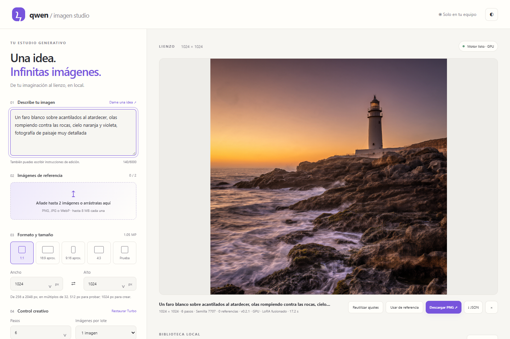
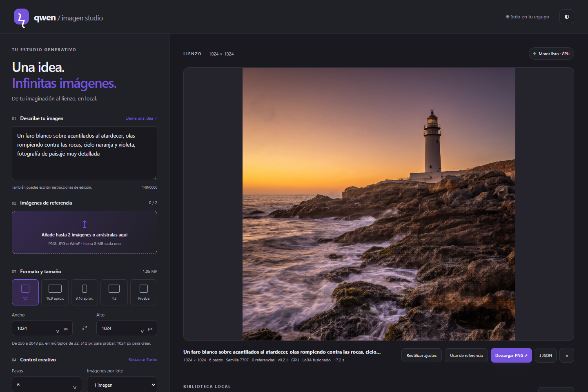
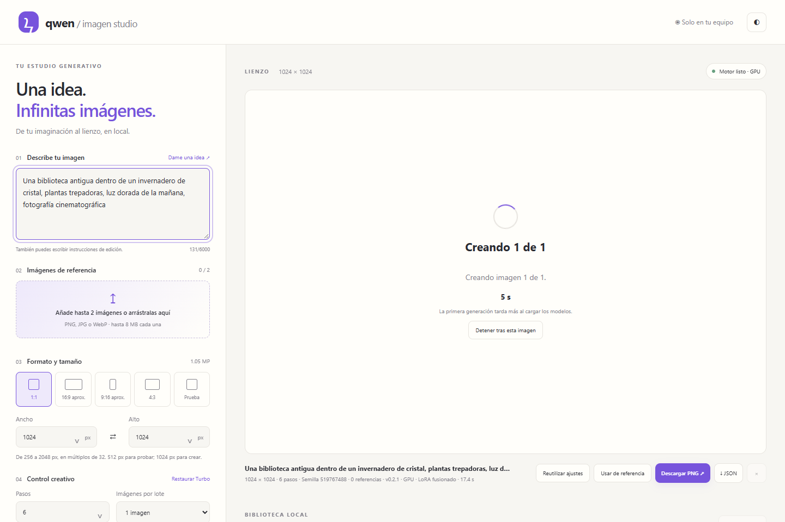
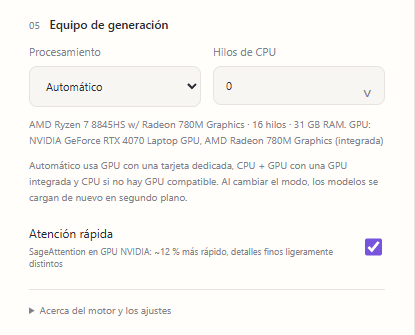
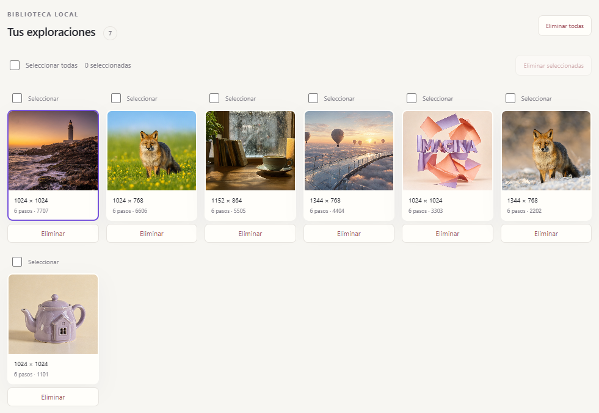
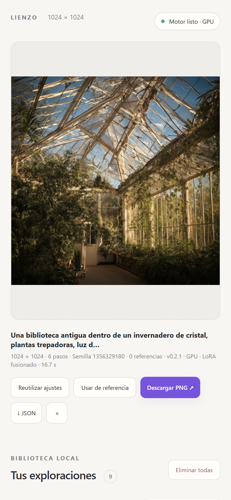

# Qwen Imagen Studio

**Crea y edita imágenes con IA en tu propio PC, con CPU, GPU o ambas.** Estudio web local en español para [Qwen-Image 2.1](https://huggingface.co/leejet/Qwen-Image-2.1-GGUF) con la aceleración [Viggle Turbo v0.2.1](https://huggingface.co/Viggle/Qwen-Image-2.1-viggle-turbo): una imagen de 1024 × 1024 en unos 18 segundos con una GPU de 8 GB, sin cuentas, sin créditos y sin enviar nada a la nube.



## Características

- **Texto → imagen** y **edición con hasta 2 imágenes de referencia** («pon el zorro de la imagen 1 en…»).
- **CPU, GPU NVIDIA (CUDA), GPU AMD/Intel (Vulkan) o CPU + GPU.** El modo automático elige lo más rápido para tu equipo, también en portátiles con GPU integrada o en PCs sin tarjeta gráfica.
- **Todo local y privado:** los prompts, referencias e imágenes no salen del equipo. Internet solo se usa durante la instalación.
- Formatos 1:1, 16:9, 9:16, 4:3 o tamaño libre de 256 a 2048 px; lotes de 1 a 8 imágenes; semillas reproducibles; fondo transparente.
- **Biblioteca local** con cada imagen y sus parámetros (PNG + JSON), reutilización de ajustes, descarga y borrado con papelera.
- Instalador que **descarga y verifica automáticamente** todo lo necesario: motores, modelos, Node.js y el runtime de Visual C++.
- Tema claro y oscuro; interfaz adaptada a móvil.

## Capturas

| Estudio (tema oscuro) | Creando una imagen |
| --- | --- |
|  |  |

| Equipo de generación: CPU, GPU o ambas | Biblioteca local | Móvil |
| --- | --- | --- |
|  |  |  |

## Requisitos

| | Mínimo | Recomendado |
| --- | --- | --- |
| Sistema | Windows 10 u 11 de 64 bits | Windows 11 |
| RAM | 16 GB (cierra otras aplicaciones pesadas) | 32 GB (equipo en el que se probó) |
| Disco libre | 25 GB durante la instalación (13 GB al terminar) | SSD |
| GPU | Opcional | NVIDIA con 8 GB de VRAM o más |
| Internet | Solo para instalar (hasta 17 GB de descarga) | — |

No necesitas instalar Python, Node.js, CUDA ni ninguna otra herramienta: el instalador se encarga. Para GPU NVIDIA basta con tener el controlador de NVIDIA actualizado; para AMD/Intel, su controlador con soporte Vulkan.

## Instalación paso a paso

1. **Descarga la app.** En esta página pulsa **Code → Download ZIP** y descomprímelo en una carpeta con al menos 25 GB libres, por ejemplo `D:\Programas\qwen-imagen-studio`. También puedes clonarla:
   ```powershell
   git clone https://github.com/jceronch1/qwen-imagen-studio.git
   ```
   Evita carpetas sincronizadas con OneDrive o similares: los modelos son archivos muy grandes.

2. **Ejecuta el instalador.** Haz doble clic en **`Instalar Qwen Imagen Studio.cmd`**.
   - Si Windows muestra *«Windows protegió su PC»*, pulsa **Más información → Ejecutar de todas formas** (ocurre con cualquier script descargado de Internet).
   - En un PC **sin tarjeta gráfica** puedes usar **`Instalar solo CPU.cmd`**, que omite los motores de GPU.

3. **Deja que termine.** El instalador muestra cada paso. Descarga solo lo que falta y verifica cada archivo con su SHA256 oficial; si se corta Internet, vuelve a ejecutarlo y continúa donde se quedó.

   | Paso | Qué hace | Tamaño |
   | --- | --- | ---: |
   | Node.js | Si no tienes Node.js 22 o posterior, descarga una copia portátil dentro de la carpeta de la app (no toca tu sistema) | 37 MB |
   | Visual C++ | Si falta el runtime de Visual C++ 2015‑2022, lo instala. Windows pedirá **permiso de administrador** una vez | 25 MB |
   | Motores | `stable-diffusion.cpp` para CPU y Vulkan, y CUDA si detecta una GPU NVIDIA | 0,05–0,95 GB |
   | Modelos | Codificador de texto Qwen3‑VL 8B, lector de imágenes de referencia y VAE | 6,9 GB |
   | Modelo de imagen | Descarga la base oficial Qwen-Image 2.1 (Q8_0) y el LoRA Viggle Turbo, los fusiona en un modelo optimizado de 4,2 GB y **borra los temporales** | 9,1 GB temporales |

   La fusión del paso final se calcula en tu CPU: unos 8 minutos en un procesador de 16 hilos, más en equipos modestos. Al terminar verás **«Instalacion completa con el modelo optimizado»**.

4. **Abre el estudio.** Haz doble clic en **`Iniciar Qwen Imagen Studio.cmd`**. Se abre el navegador en http://127.0.0.1:7871 y los modelos se cargan en segundo plano (indicador **Cargando modelos…**, unos 10 s con GPU). Mientras tanto ya puedes escribir tu primera idea.

5. **Para cerrarlo**, usa **`Detener Qwen Imagen Studio.cmd`**: cierra la app y libera la memoria. Tus imágenes quedan guardadas en la carpeta `outputs`.

> Si el cálculo de la fusión no puede completarse, el instalador instala automáticamente el **modo compatible** (la misma calidad, aplicando el LoRA durante la generación, algo más lento). Puedes volver a ejecutar el instalador más tarde para crear el modelo optimizado.

## Cómo crear una imagen

1. **Describe tu imagen** en español o inglés. «Dame una idea» carga un ejemplo.
2. Opcional: **añade hasta 2 imágenes de referencia** (PNG, JPG o WebP de hasta 8 MB) y menciónalas como «imagen 1» e «imagen 2» para editarlas o combinarlas.
3. Elige el **formato** (512 × 512 para probar, 1024 × 1024 para crear) o escribe ancho y alto (múltiplos de 32, de 256 a 2048).
4. Deja **6 pasos** (configuración Turbo recomendada), elige cuántas imágenes y la **semilla** (−1 = aleatoria; la misma semilla repite la imagen).
5. Pulsa **Crear imagen** o `Ctrl + Enter`. Puedes cerrar la pestaña: la generación continúa y la web la recupera al volver.

Cada imagen se guarda en `outputs/` junto a un JSON con todos sus parámetros. Desde la biblioteca puedes **reutilizar ajustes**, **usarla como referencia**, descargarla o eliminarla (lo eliminado va a `outputs/.trash/`).

## CPU, GPU o ambas

En **05 · Equipo de generación → Procesamiento**:

| Modo | Cuándo usarlo |
| --- | --- |
| **Automático** | Recomendado. GPU si hay tarjeta dedicada, CPU + GPU si solo hay GPU integrada, CPU si no hay GPU compatible. |
| **GPU** | Tarjeta dedicada NVIDIA (CUDA) o AMD/Intel (Vulkan). Lo más rápido. |
| **CPU + GPU** | GPU integrada (por ejemplo Radeon 780M) o con poca VRAM: el texto se procesa en la CPU y la imagen en la GPU. |
| **CPU** | Equipos sin GPU. Funciona, pero tarda minutos por imagen: empieza con 512 × 512. |

**Atención rápida** (activada por defecto, solo NVIDIA) usa SageAttention: un 12 % más rápido con la misma composición y calidad; los detalles finos pueden variar ligeramente. Desactívala si quieres reproducir exactamente imágenes creadas sin ella.

## Rendimiento de referencia

Portátil con Ryzen 7 8845HS, 32 GB de RAM y RTX 4070 Laptop de 8 GB, 6 pasos:

| Caso | Tiempo por imagen |
| --- | ---: |
| GPU · 512 × 512 | 4,4 s |
| GPU · 1024 × 1024 | 17–18 s |
| GPU · 2048 × 2048 | 88 s |
| CPU + GPU integrada (Radeon 780M) · 512 × 512 | 74 s |
| Solo CPU · 512 × 512 | ≈ 4 min |

Los detalles de cada optimización y cómo se midieron están en [docs/TECNICO.md](docs/TECNICO.md).

## Solución de problemas

| Síntoma | Solución |
| --- | --- |
| «Descarga interrumpida» durante la instalación | Vuelve a ejecutar el instalador: reanuda la descarga. |
| «Falta …. Ejecuta Instalar Qwen Imagen Studio.cmd» al iniciar | La instalación no terminó; ejecuta de nuevo el instalador. |
| «La GPU no tuvo memoria suficiente» | Usa un tamaño menor, el modo **CPU + GPU** o **CPU**, y cierra otros programas que usen la GPU. |
| «No quedó suficiente memoria RAM» | Cierra aplicaciones pesadas o reduce el tamaño de la imagen. |
| No aparece mi GPU | Actualiza el controlador (NVIDIA, AMD o Intel) y vuelve a abrir la app. |
| El puerto 7871 está ocupado | Cierra la otra instancia con `Detener Qwen Imagen Studio.cmd`. |

Los registros están en la carpeta `logs/` (`engine.err.log`, `engine.out.log`, `app.err.log`).

## Actualizar o desinstalar

- **Actualizar:** descarga la nueva versión encima de la carpeta (o `git pull`) y ejecuta de nuevo el instalador; solo descarga lo que haya cambiado.
- **Desinstalar:** ejecuta `Detener Qwen Imagen Studio.cmd` y borra la carpeta. Guarda antes tus imágenes de `outputs/` si las quieres conservar. La app no escribe fuera de su carpeta (salvo el runtime de Visual C++, si lo instaló).

## Estructura del proyecto

```
app/                  Interfaz web (HTML, CSS y JavaScript sin dependencias)
scripts/              Servidor Node, gestor del motor, instalador y pruebas
docs/                 Documentación técnica y capturas
qa/optimizacion/      Mediciones usadas para elegir la configuración del motor
models/               Licencia y aviso de los modelos (los pesos los descarga el instalador)
model-config.json     Versiones, revisiones y hashes fijados de los modelos
*.cmd                 Instalar, iniciar y detener con doble clic
```

Carpetas creadas por el instalador y la app (no forman parte del repositorio): `models/` (pesos), `runtime-*` (motores), `node/`, `outputs/`, `logs/` y `.downloads/`.

## Licencias y créditos

- **Código de la app:** licencia [MIT](LICENSE). Puedes usarlo, modificarlo y redistribuirlo, también con fines comerciales, conservando el aviso de copyright. La licencia MIT cubre solo el código, no los modelos.
- **Modelos:** Qwen-Image 2.1 y el LoRA Viggle Turbo están bajo la **Qwen RESEARCH LICENSE AGREEMENT**, que permite solo **uso no comercial (investigación o evaluación)**; para uso comercial hay que solicitar una licencia a Qwen. Texto completo en [models/LICENSE-Viggle.txt](models/LICENSE-Viggle.txt) y aviso en [models/NOTICE-Viggle.txt](models/NOTICE-Viggle.txt). *Qwen is licensed under the Qwen RESEARCH LICENSE AGREEMENT, Copyright (c) 2026 Hangzhou Tongyi Laboratory Technology Co., Ltd. All Rights Reserved.* **Built with Qwen.**
- El codificador Qwen3‑VL y el VAE se descargan de sus repositorios oficiales y mantienen sus propias licencias; consulta cada página enlazada en [docs/TECNICO.md](docs/TECNICO.md).
- Motor de inferencia: [stable-diffusion.cpp](https://github.com/leejet/stable-diffusion.cpp) de leejet, basado en [ggml](https://github.com/ggml-org/ggml).
- Aceleración Turbo: [Viggle](https://huggingface.co/Viggle/Qwen-Image-2.1-viggle-turbo).

Este repositorio contiene solo el código de la app; no redistribuye ningún peso de modelo.
